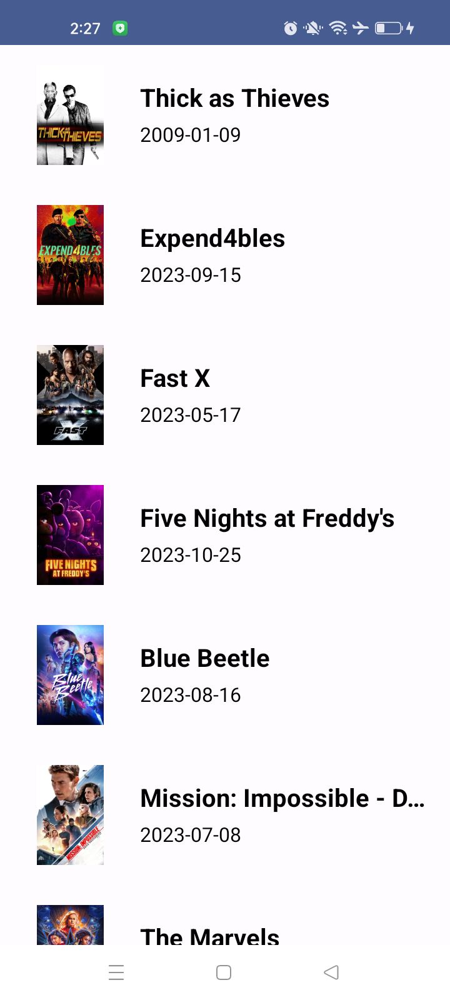

# themoviedb
Movie listing app using Jetpack Compose and [Tmdb api](https://www.themoviedb.org/), showcasing Android best practices with Google's recommended architecture: Clean Architecture + MVVM + Repository + Offline support (Room) + Android Architecture Components + Retrofit2 + Hilt + Coil + Compose.

# Screenshot of the result

# Implementation
- In this project I applied Clean architecture with (MVVM Pattern + State Management) to apply Separation of concerns.
- Using kotlin coroutines to handle heavy operations on the background thread.
- Using Hilt for dependency injection that will make code cleaner and more readable and handy when creating dependecies and testable easier.
- I have used a compination of **Compose** and Normal XML.
- Using Retrofit to implement Api calls.

# Clean Architecture 

# Clean Architecture layers 

## Tech Stack
- kotlin.
- Compose
- Clean Architecure with (MVVM + StateManagement).
- Coroutines.
- Retrofit2.
- recycler view.
- ConstraintLayout.
- viewmodel and MutableStateFlow.
- offline support using room.
- Single source of truth to get data
- Dagger Hilt for DI.
- Coil
